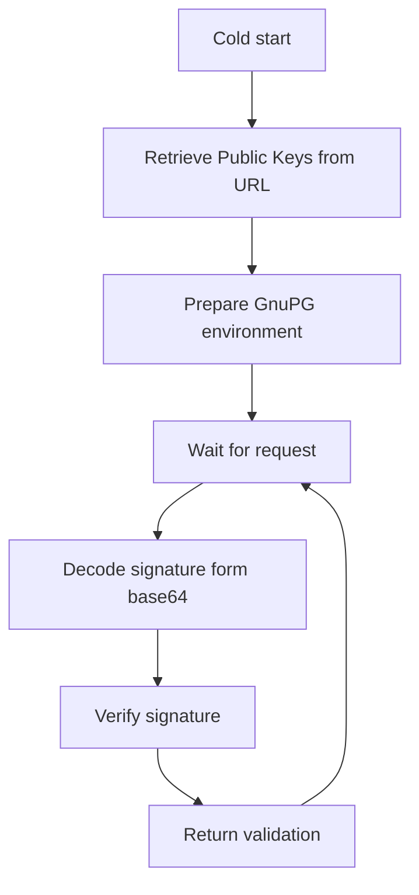

# GnuPG Authorizer
Authorizer based on GnuPG `clearsign` signatures. Downloads the public keys from an endpoint that serves them as asc-files.

## Environment Configuration

| Env name       | Default | Description                                                             |
|----------------|:-------:|-------------------------------------------------------------------------|
| GRACE_PERIOD   |   60    | Grace period or timeout of a GnuPG signature in seconds                 |
| GPG_HOME       | `/tmp/` | GnuPG home folder which either contains, or will contain GnuPG keyrings |
| GPG_BIN        |  `gpg`  | Path (or command) to GnuPG binary                                       |
| PUBLIC_KEY_URL |         | URL to internet endpoint that serves public keys as asc-file            |

## Application flow
