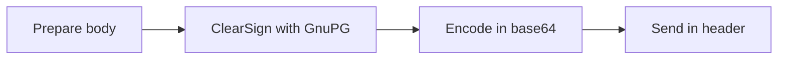

# Authorizing Headaches

The signing flow:


Using the clearsign option in GnuPG results in an ASCII file with the original body. The complete file is needed to verify the signature.

## All that went wrong

It has been a journey to get [GnuPG](https://gnupg.org/) to work inside a lambda function. I will give you a quick summary:

- Missing invoke permissions
- No bodies in authorizers
- A lack of reading comprehension and building a Lambda Layer on false assumptions
- Chickening out on compiling from source
- Switching to a Container Function
- Keys too new/software too old
- Compile from source anyway

### Missing invoke permissions
It all started after my first successful deployment. Test invocations were met with status code 500. No logs were generated on the authorizer function, which was the big hint. It took me a second to figure out that SAM does setup permissions for all the functions defined inside the `events:`-blocks, but not for functions defined in the `authorizers:`-block. Below is the CloudFormation I had to add to have it work:

```yaml
  AuthorizerResourcePolicy:
    Type: AWS::Lambda::Permission
    Properties:
      FunctionName: !Ref GnuPGLambdaAuthorizer
      Action: lambda:InvokeFunction
      Principal: apigateway.amazonaws.com
      SourceArn: !Sub "arn:aws:execute-api:${AWS::Region}:${AWS::AccountId}:${ShortenerAPI}/*"
```

### No bodies in authorizers
Originally, I wanted to use the signature as a separate object in the headers. I originally thought authorizers would also get the request body. I assumed, as AWS also uses a [signature method](https://docs.aws.amazon.com/general/latest/gr/create-signed-request.html) where the body needs to be available to validate a request. However, it ain't so. 

This is the reason I had to rely on the [clear signing feature](https://www.gnupg.org/documentation/manuals/gnupg/Operational-GPG-Commands.html) of GnuPG to include the body for verification by the authorizer.

## A lack of reading comprehension and building a Lambda Layer on false assumptions

When looking for a [testing method](https://docs.aws.amazon.com/lambda/latest/dg/images-test.html) to test lambda functions before understanding how to use [SAM for that](https://docs.aws.amazon.com/serverless-application-model/latest/developerguide/serverless-test-and-debug.html). I was testing inside t[he AWS provided lambda/python container](https://gallery.ecr.aws/lambda/python) and found the `gpg`-bin inside and assumed the Lambda runtime environment would have it as well.

So, my first attempt at making GnuPG work was with a layer that included the `python-gnupg` package. SAM can [build layers](https://docs.aws.amazon.com/serverless-application-model/latest/developerguide/building-layers.html) with its tooling. Add some metadata and you are good to go:

```yaml
  AuthLayer:
    Type: AWS::Serverless::LayerVersion
    DeletionPolicy: Delete
    Properties:
      LayerName: GnuGP-Layer
      Description: A layer for the gnupg authorizer
      CompatibleRuntimes:
        - python3.9
      CompatibleArchitectures:
        - arm64
        - x86_64
      ContentUri: authorizer/layer
    Metadata:
      BuildMethod: python3.9
```

The above code will build a lambda layer with a `requirements.txt` file found in the `ContentURI`.

However, it didn't work. I got messages that `gpg` was not available. And one [`os.listdir(/usr/bin/)`](https://www.geeksforgeeks.org/python-os-listdir-method/) line later, I am now aware that the Lambda environment is stripped of any extra executable. I could have expected that, but now I know.

## Chickening out on compiling from source
Next stop: [StackOverflow](https://stackoverflow.com/questions/67782720/how-to-use-gnupg-in-an-aws-lambda-function). I was stubborn - the theme of this adventure - on using a layer. One of the suggested methods was to compile static-linked gpg executables. Unfortunately for me, I have no experience with compiling static linked executables. Sure, I have compiled from source. But it never went beyond just running the `make build` or `make install`. My experience with compiled languages is with Java and Go. So, this would be a challenge.

I made the following `makefile` that SAM can call for building layers:

```makefile
CC = gcc
CFLAGS='-static'

DOWNLOAD_DIR=/tmp/download
GPG_BUILD_DIR=/tmp/gpg
PYTHON_DIR="$(ARTIFACTS_DIR)/python"  

build-AuthLayer:
    yum install -y gcc make glibc-static sqlite gnutls libsqlite3-dev adns-tools
    mkdir -p ${DOWNLOAD_DIR} ${PYTHON_DIR} ${GPG_BUILD_DIR}
    curl https://www.gnupg.org/ftp/gcrypt/gnupg/gnupg-2.4.0.tar.bz2 --output "$(DOWNLOAD_DIR)/gnupg.tar.bz2"
    tar -xf "$(DOWNLOAD_DIR)/gnupg.tar.bz2" --directory ${GPG_BUILD_DIR} --strip-components=1
    ${GPG_BUILD_DIR}/configure
    make CFLAGS='-static'
    cp ${GPG_BUILD_DIR}/g10/gpg ${PYTHON_DIR}
    python -m pip install -r requirements.txt -t ${PYTHON_DIR}
```

We only have to instruct SAM to look for a makefile by changing the buildmethod in the metadata:

```yaml
    Metadata:
      BuildMethod: makefile
```

Unfortunately, this was met with configuration errors. A few hours were spent on trying to fix them. Then I gave up and finally relented: I made a Dockerfile.

## Troubles switching to a container function
Now I had a container image with my custom authorizer. It built, but I was met with a new error, from CloudFormation. The problem can be found in [this version of the templates file](https://github.com/Scribbd/scribbdurlshortener/blob/0f897e0dcb3116159e8ecd48eeb7df72681d25e1/template.yaml#L57-L67). But might be better explained within this [open issue](https://github.com/aws/serverless-application-model/issues/1874) on the SAM GitHub repository:

```yaml
AWSTemplateFormatVersion: 2010-09-09
Transform: AWS::Serverless-2016-10-31

Globals:
  Function:
    Runtime: python3.8
    Handler: index.lambda_handler
    MemorySize: 128

Resources:
  ZipFunction:
    Type: AWS::Serverless::Function
    Properties:
      CodeUri: ./src/zip

  ImageFunction:
    Type: AWS::Serverless::Function
    Properties:
      PackageType: Image
    Metadata:
      Dockerfile: Dockerfile
      DockerContext: ./src/image
```
The above example template will cause an error. SAM gets confused and adds the global values that should only apply to a `ZipFunction` also to the `ImageFunction`. This causes illegal properties to be defined inside the `ImageFunction` and CloudFormation will break.

The only solution: Extract these global values, and duplicate it through the functions. In my honest opinion, a `-1` for SAM that aims to debulk serverless templates.

## Keys too new/software too old
Deploying functionality restored. Tests of code succeed. Let's invoke the API... and!

```shell
gpg: key F0ADACBB: no valid user IDs
gpg: this may be caused by a missing self-signature
gpg: key 87A6D27D: no valid user IDs
gpg: this may be caused by a missing self-signature
gpg: Total number processed: 2
gpg:           w/o user IDs: 2
```

Let's check something inside a running container:

```shell
$ gpg --version
gpg (GnuPG) 2.0.22
```

So, AWS is packaging a [since 2017 EOL](https://gnupg.org/download/index.html#end-of-life) gpg version with their OS. I tested with RSA keys. My own keys are ECC. ECC got supported from [GnuPG v2.1 and up](https://wiki.gnupg.org/ECC). I was back to square one.

I hope the release of [Amazon Linux 2022/2023](https://docs.aws.amazon.com/linux/al2023/ug/what-is-amazon-linux.html) is soon. 

## Compile from source anyway

Someone luckily did a good job in streamlining compiling gpg: [Skeeto's Lean and static gpg repo](https://github.com/skeeto/lean-static-gpg.git). I do understand the risk of trusting an external script. But I wanted to be done with this. Not expecting much, I updated my Dockerfile to include a new stage:

```dockerfile
FROM public.ecr.aws/docker/library/python:3.9-slim as build
WORKDIR /app
COPY requirements.txt .
RUN python3 -m pip install -r requirements.txt -t .

FROM public.ecr.aws/lambda/python:3.9 as gnupg
RUN yum install git tar gcc make bzip2 hostname -y
RUN git clone https://github.com/skeeto/lean-static-gpg.git .
RUN ./build.sh

FROM public.ecr.aws/lambda/python:3.9
COPY --from=gnupg ${LAMBDA_TASK_ROOT}/gnupg ${LAMBDA_TASK_ROOT}
COPY --from=build /app/ ${LAMBDA_TASK_ROOT}
COPY /src ${LAMBDA_TASK_ROOT}
CMD ["src.authorizer.lambda_handler"]

```

And it worked! I was finally able to start debugging my API.

## What I learned

A wise security expert once told me: Don't implement your own security algorithms, just stick to the standards like JWT. I thought I was safe with using GnuPG, as it was a standard. But that standard was made in a different time, a different era of the internet. An era where humans were looking for a way to trust on the internet. GnuPG was made for human interactions.

I will be looking into implementing a flavor of JWT next time.
